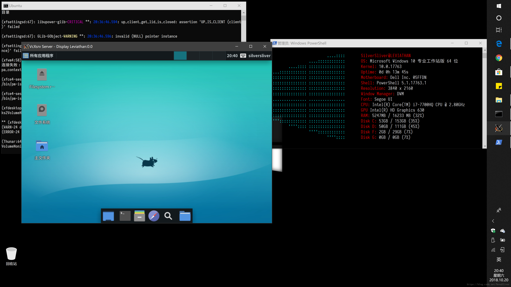
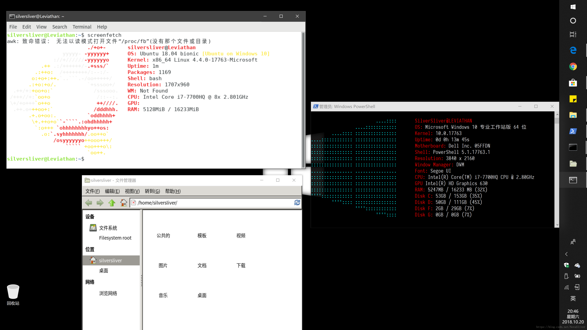

### part1：UbuntuWindows子系统搭建

#### 1 WIN10下linux环境安装

打开Linux子系统（这一步基本没问题）
打开 控制面板——程序和功能——（左侧）启用或关闭Windows子功能——勾选“适用于Linux的Windows子系统”（如下图所示）——点击“确定”，电脑下载结束后进行重启

  

#### 2 开发人员设置

打开 设置——更新和安全——开发者选项——选择“开发人员模式”（重启，按照电脑提示进行）

  

#### 3 安装Bash

常规操作就是在Microsoft Store上搜索Ubuntu，然后选择Ubuntu18.04LTS，不要选下图第一个选项，有坑

#### 4 Ubuntu换国内源

备份`/etc/apt/sources.list`的源内容 

```bash
#备份
cp /etc/apt/sources.list /etc/apt/sources.list.bak
```

 替换`/etc/apt/sources.list`的源内容 

```bash
sudo vim /etc/apt/sources.list
```

 将以下内容替换到里面（使用[vim常用指令](https://www.cnblogs.com/zhanbing/p/10943161.html)）

```
##中科大源
deb https://mirrors.ustc.edu.cn/ubuntu/ bionic main restricted universe multiverse
deb-src https://mirrors.ustc.edu.cn/ubuntu/ bionic main restricted universe multiverse
deb https://mirrors.ustc.edu.cn/ubuntu/ bionic-updates main restricted universe multiverse
deb-src https://mirrors.ustc.edu.cn/ubuntu/ bionic-updates main restricted universe multiverse
deb https://mirrors.ustc.edu.cn/ubuntu/ bionic-backports main restricted universe multiverse
deb-src https://mirrors.ustc.edu.cn/ubuntu/ bionic-backports main restricted universe multiverse
deb https://mirrors.ustc.edu.cn/ubuntu/ bionic-security main restricted universe multiverse
deb-src https://mirrors.ustc.edu.cn/ubuntu/ bionic-security main restricted universe multiverse
deb https://mirrors.ustc.edu.cn/ubuntu/ bionic-proposed main restricted universe multiverse
deb [arch=amd64] https://download.docker.com/linux/ubuntu bionic stable
# deb-src [arch=amd64] https://download.docker.com/linux/ubuntu bionic stable
deb-src https://mirrors.ustc.edu.cn/ubuntu/ bionic-proposed main restricted universe multiverse
```

更新软件源并安装更新：

```bash
sudo apt-get update && sudo apt-get --assume-yes upgrade
```

#### 5 Linux子系统（WSL）图形界面的安装(非必要)

安装桌面以及一些运行必要的插件（Xfce，基于GTK2.0，和旧版Gnome界面类似）：

```bash
sudo apt-get install --assume-yes xfce4 xorg-dev libopencc2 libopencc2-data libqt4-opengl libqtwebkit4 unzip zip
```

再其次我们就可以再安装一些平常用的软件了，比如Firefox浏览器和输入法：

火狐：

```bash
sudo apt-get install --assume-yes firefox firefox-locale-zh-hans
```


输入法（核心）：

```
sudo apt-get install --assume-yes fcitx dbus-x11 fcitx-libs libfcitx-qt0
```


如果是安装搜狗输入法可以去搜狗输入法Linux官网下载安装（这里不推荐，在子系统下可能会遇到有乱码的问题），想要安装sunpinyin的话就在上面的命令后面加上空格fcitx-sunpinyin，libpinyin就在上面的命令加上空格fcitx-libpinyin；

中文字体安装及中文配置：

```bash
#安装字体管理包
sudo apt-get install --assume-yes fontconfig
#安装中文字体
sudo mkdir -p /usr/share/fonts/windows
sudo cp -r /mnt/c/Windows/Fonts/*.ttf /usr/share/fonts/windows/
#清除字体缓存
fc-cache
#生成中文环境
sudo locale-gen zh_CN.UTF-8
```


截止到目前字符界面流程基本结束，剩下的如果可以建议将下面几条环境变量配置在系统环境变量/etc/profile下，但不添加不影响使用桌面：

```
export DISPLAY=localhost:0
export LANG=zh_CN.UTF-8
export LANGUAGE=zh_CN.UTF-8
export LC_ALL=zh_CN.UTF-8
```


配置好环境变量后需要更新环境：

```
source /etc/profile
```

安装输出图形界面所需要的软件

下载[vcxsv](https://sourceforge.net/projects/vcxsrv/)（建议在翻墙环境中下载），点击download下载安装好就可以了，然后下载[脚本包](https://github.com/Nova-cjp/Ubuntu-script)，双击bat就可以打开xfce桌面了（不要关闭后面的Bash终端），关闭也很简单，只需要点击图形界面右上角的x即可（不要直接关闭后面的Bash终端）



子系统在Windows下的目录

这里以Ubuntu为例，中间 “CanonicalGroupLimited.UbuntuonWindows_79rhkp1fndgsc” 可能不一致，只需找到相应发行版的文件夹即可，不建议对这个文件目录进行写操作，容易出现权限问题

```
C:\Users\SilverSliver\AppData\Local\Packages\CanonicalGroupLimited.UbuntuonWindows_79rhkp1fndgsc\LocalState\rootfs
```


如果想要不打开桌面，同时运行Windows程序和Linux程序

首先一定要添加上面提供的环境变量，其次下载刚才提供的文件夹内所提供的剩余两个文件，双击UbuntuMul.bat，在弹出的Bash窗口输入对应指令即可启动对应的Linux程序。效果如图（打开了Linux的Thunar文件管理器和gnome-terminal）：



最终如果桌面出现任何显示上的问题，请打开Ubuntu应用，输入并执行`rm  -rf ~/.config/xfce4`和`rm -rf ~/.cache/sessions`

### part2：斯坦福CS231n课程深度学习环境搭建

#### 1 在本地win10系统上安装anaconda

- 进入Anaconda的官网进行下载或学习。
- 选择你想下载的Python版本，这里我们选择的是Python3.6
- 选择你的操作系统和位数，这里我们选择的是Windows64位
- 然后点击Download按钮就开始下载了

安装
找到安装包所在的目录，双击安装包

点击Next

点击I Agree

选择你想安装的路径，之后一路默认就ok了

配置环境变量：

如果你在安装过程中勾选了Add PATH 那个选项，那么你不需要额外配置环境变量，
但是如果你没有勾选（默认是不勾选的），那么你需要按照以下标准去配置（路径根据自己的安装位置变化）

 

#### 2 在课程网站上下载作业压缩包

- 登陆http://cs231n.stanford.edu/
  
- 进入sylabus
  
- 点击下载SLIDE,NOTE,及ASSIGNMENT
  

#### 3 下载作业及数据集

bash中进入assignment作业包的存放目录，方法如2.

1. 在win10环境下访问Ubuntu文件系统的home目录：

   ```
   C:\Users\xxx\AppData\Local\Packages\CanonicalGroupLimited.UbuntuonWindows_79rhkp1fndgsc\LocalState\rootfs\home\xxx
   ```

   


2. 在Ubuntu系统下访问win10的home目录：
   `/mnt/c/Users/xxx`

 运行.sh文件 

```
 cd assignment1/cs231n/datasets/ 
./get_datasets.sh 
```

获取CIFAR10数据

 

#### 4 建立课程作业的虚拟环境

打开ANACONDA PROMPT 命令行窗口
运行（在终端中）`conda create -n cs231n python=3.6 anaconda` 创建一个叫做cs231n的环境。

```
conda create -n cs231n python=3.6 anaconda 
```

注意：python=3.6 需要根据实际的python版本设置

注意：python=3.6 需要根据实际的python版本设置

 

激活并进入环境，请运行 `source activate cs231n`
要退出，您只需关闭窗口或运行`source deactivate cs231n`即可
请注意，每次要处理作业时，都应该运行 `source activate cs231n`

#### 5 使用ipython开始编辑作业

ipython是Anaconda中安装好的一个编译器，你如果在上面安装完Anaconda后执行了conda list 会看到ipython

在终端执行打开ipython

```
ipython notebook
```

然后就可以点击assignment1文件夹中的.ipynb文件跑CS231n课程中的代码了
